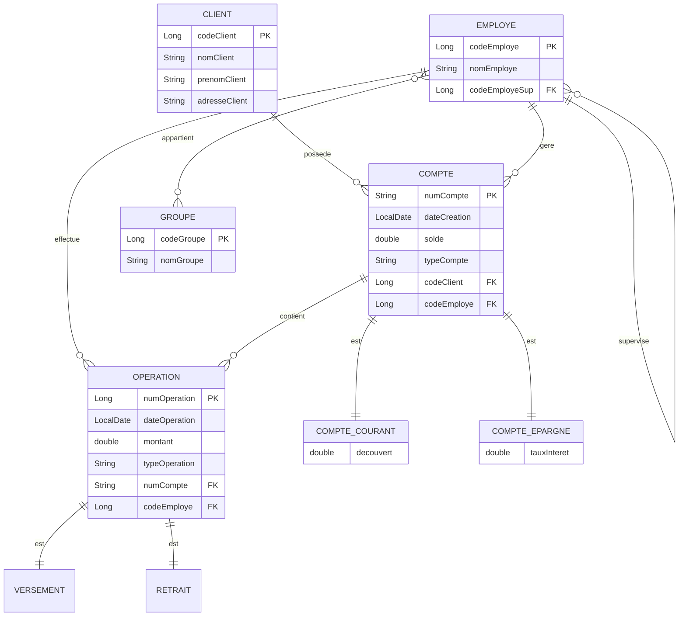

# 📋 COMPTE RENDU DE PROJET
## Application de Gestion Bancaire avec Spring Boot 3

---

### Informations Générales

**Titre du Projet :** Application de Gestion Bancaire  
**Technologies :** Spring Boot 3, PostgreSQL, Thymeleaf, Gradle  
**Date :** Novembre 2025  
**Frameworks :** Spring Data JPA, Spring Web, Swagger/OpenAPI  

---

## TABLE DES MATIÈRES

1. [Introduction](#1-introduction)
2. [Objectifs du Projet](#2-objectifs-du-projet)
3. [Technologies Utilisées](#3-technologies-utilisées)
4. [Architecture du Projet](#4-architecture-du-projet)
5. [Modèle de Données](#5-modèle-de-données)
6. [Fonctionnalités Implémentées](#6-fonctionnalités-implémentées)
7. [Structure du Code](#7-structure-du-code)
8. [API REST](#8-api-rest)
9. [Interface Web](#9-interface-web)
10. [Installation et Configuration](#10-installation-et-configuration)
11. [Tests et Validation](#11-tests-et-validation)
12. [Difficultés Rencontrées](#12-difficultés-rencontrées)
13. [Résultats et Démonstration](#13-résultats-et-démonstration)
14. [Conclusion](#14-conclusion)

---

## 1. INTRODUCTION

Ce projet consiste à développer une **application complète de gestion bancaire** utilisant les technologies modernes de l'écosystème Spring. L'application permet de gérer les clients, les employés, les comptes bancaires (courants et épargne) et les opérations financières (versements, retraits, virements).

Le projet a été développé en suivant les **bonnes pratiques** de l'architecture MVC (Model-View-Controller) et en utilisant les patterns modernes du développement d'applications d'entreprise.

### Contexte

L'application simule un système de gestion bancaire où :
- Les **clients** peuvent avoir plusieurs comptes
- Les **employés** gèrent les comptes et effectuent les opérations
- Les **comptes** peuvent être de type courant (avec découvert) ou épargne (avec taux d'intérêt)
- Les **opérations** incluent les versements, retraits et virements

### Captures d'Écran Project

1. **Page d'accueil** (`/banque`)
   - Tableau des comptes avec données réelles
   
    - Vue du dashboard avec les 4 cartes d'actions rapides
   

2. **Page détails compte** (`/comptes/CC001`)
   - Informations du compte et du client
   - Historique des opérations
   
   

3. **Page consultation opérations** (`/operations`)
   - Formulaire de sélection de compte
   - Liste des opérations d'un compte
   
   
   

4. **Page effectuer opérations** (`/operations-form`)
   - Les 3 formulaires côte à côte (vert, rouge, bleu)
   - Message de succès après une opération
   - Message d'erreur en cas de validation échouée
   

5. **Swagger UI** (`/swagger-ui.html`)
   - Vue d'ensemble des endpoints
   - Exemple de requête avec réponse
   


---

## 2. OBJECTIFS DU PROJET

### Objectifs Principaux

1. **Développer une application bancaire fonctionnelle** avec Spring Boot 3
2. **Implémenter une architecture MVC complète** avec séparation des responsabilités
3. **Créer une API REST** documentée et testable
4. **Gérer des relations JPA complexes** (OneToMany, ManyToOne, ManyToMany, auto-référencement)
5. **Implémenter l'héritage JPA** pour les comptes et opérations
6. **Fournir une interface web moderne** avec Thymeleaf et Tailwind CSS
7. **Assurer la persistance des données** avec PostgreSQL

### Objectifs Techniques

- ✅ Utilisation de **Spring Boot 3.3.4** et **Java 17**
- ✅ Gestion des transactions avec **@Transactional**
- ✅ Documentation automatique avec **Swagger/OpenAPI**
- ✅ Validation des opérations bancaires (découvert, solde)
- ✅ Relations JPA complexes et héritage SINGLE_TABLE
- ✅ Interface responsive avec **Tailwind CSS**

---

## 3. TECHNOLOGIES UTILISÉES

### Backend

| Technologie | Version | Rôle |
|------------|---------|------|
| **Java** | 17 | Langage de programmation |
| **Spring Boot** | 3.3.4 | Framework principal |
| **Spring Data JPA** | 3.3.4 | Couche de persistance |
| **Hibernate** | 6.x | Implémentation JPA |
| **Spring Web** | 3.3.4 | API REST et MVC |
| **PostgreSQL** | 15+ | Base de données relationnelle |
| **Lombok** | Latest | Réduction du code boilerplate |

### Frontend

| Technologie | Version | Rôle |
|------------|---------|------|
| **Thymeleaf** | 3.2.0 | Moteur de templates |
| **Tailwind CSS** | 3.x | Framework CSS |
| **HTML5** | - | Markup |

### Documentation et Build

| Technologie | Version | Rôle |
|------------|---------|------|
| **Swagger/OpenAPI** | 2.5.0 | Documentation API |
| **Gradle** | 8.5 | Gestionnaire de build |

---

## 4. ARCHITECTURE DU PROJET

### 4.1 Architecture Générale

Le projet suit une **architecture en couches (Layered Architecture)** conforme au pattern MVC :

```
┌─────────────────────────────────────────────┐
│         COUCHE PRÉSENTATION                 │
│  ┌──────────────┐      ┌─────────────────┐ │
│  │ Thymeleaf    │      │  REST API       │ │
│  │ Templates    │      │  (JSON)         │ │
│  └──────────────┘      └─────────────────┘ │
└──────────────┬───────────────┬──────────────┘
               │               │
               ▼               ▼
┌─────────────────────────────────────────────┐
│         COUCHE CONTRÔLEUR                   │
│  ┌──────────────┐      ┌─────────────────┐ │
│  │ Web          │      │  REST           │ │
│  │ Controller   │      │  Controller     │ │
│  └──────────────┘      └─────────────────┘ │
└──────────────┬──────────────────────────────┘
               │
               ▼
┌─────────────────────────────────────────────┐
│         COUCHE SERVICE                      │
│  ┌────────────────────────────────────────┐ │
│  │  BanqueService (Interface)             │ │
│  │  BanqueServiceImpl (@Transactional)    │ │
│  └────────────────────────────────────────┘ │
└──────────────┬──────────────────────────────┘
               │
               ▼
┌─────────────────────────────────────────────┐
│         COUCHE REPOSITORY                   │
│  ┌────────────────────────────────────────┐ │
│  │  Spring Data JPA Repositories          │ │
│  └────────────────────────────────────────┘ │
└──────────────┬──────────────────────────────┘
               │
               ▼
┌─────────────────────────────────────────────┐
│         COUCHE ENTITÉ (MODEL)               │
│  ┌────────────────────────────────────────┐ │
│  │  Entités JPA avec Relations            │ │
│  └────────────────────────────────────────┘ │
└──────────────┬──────────────────────────────┘
               │
               ▼
┌─────────────────────────────────────────────┐
│         BASE DE DONNÉES PostgreSQL          │
└─────────────────────────────────────────────┘
```

### 4.2 Séparation des Responsabilités

#### **Couche Entité (Entity)**
- Définition du modèle de données
- Annotations JPA (@Entity, @Table, @Column)
- Relations entre entités (@OneToMany, @ManyToOne, etc.)
- Héritage avec stratégie SINGLE_TABLE

#### **Couche Repository**
- Accès aux données via Spring Data JPA
- Query methods personnalisées
- Aucune logique métier

#### **Couche Service**
- **Logique métier** centralisée
- Gestion des transactions (@Transactional)
- Validation des règles métier (découvert, solde)
- Orchestration des opérations complexes

#### **Couche Controller**
- Exposition des endpoints REST
- Gestion des templates Thymeleaf
- Validation des requêtes HTTP
- Gestion des exceptions

---

## 5. MODÈLE DE DONNÉES

### 5.1 Diagramme Entité-Association



### 5.2 Description des Entités

#### **Client**
Représente un client de la banque.

| Champ | Type | Description |
|-------|------|-------------|
| `codeClient` | Long | Clé primaire (auto-incrémentée) |
| `nomClient` | String | Nom du client (obligatoire) |
| `prenomClient` | String | Prénom du client (obligatoire) |
| `adresseClient` | String | Adresse du client |
| `comptes` | List<Compte> | Liste des comptes du client |

#### **Employe**
Représente un employé de la banque avec une hiérarchie.

| Champ | Type | Description |
|-------|------|-------------|
| `codeEmploye` | Long | Clé primaire (auto-incrémentée) |
| `nomEmploye` | String | Nom de l'employé (obligatoire) |
| `employeSup` | Employe | Superviseur (auto-référencement) |
| `groupes` | List<Groupe> | Groupes d'appartenance (Many-to-Many) |

**Particularité :** Relation auto-référençante permettant de définir une hiérarchie d'employés.

#### **Groupe**
Représente un groupe d'employés (ex: Direction, Conseillers).

| Champ | Type | Description |
|-------|------|-------------|
| `codeGroupe` | Long | Clé primaire (auto-incrémentée) |
| `nomGroupe` | String | Nom du groupe (unique) |
| `employes` | List<Employe> | Liste des employés du groupe |

#### **Compte (Abstract)**
Classe abstraite pour les comptes bancaires.

| Champ | Type | Description |
|-------|------|-------------|
| `numCompte` | String | Clé primaire (numéro de compte) |
| `dateCreation` | LocalDate | Date de création du compte |
| `solde` | double | Solde actuel |
| `client` | Client | Propriétaire du compte (Many-to-One) |
| `employe` | Employe | Gestionnaire du compte |
| `operations` | List<Operation> | Historique des opérations |

**Stratégie d'héritage :** SINGLE_TABLE avec discriminateur `type_compte`

#### **CompteCourant**
Hérite de Compte, ajoute la notion de découvert.

| Champ | Type | Description |
|-------|------|-------------|
| `decouvert` | double | Montant de découvert autorisé |

**Discriminateur :** `CC`

#### **CompteEpargne**
Hérite de Compte, ajoute un taux d'intérêt.

| Champ | Type | Description |
|-------|------|-------------|
| `tauxInteret` | double | Taux d'intérêt annuel (%) |

**Discriminateur :** `CE`

#### **Operation (Abstract)**
Classe abstraite pour les opérations bancaires.

| Champ | Type | Description |
|-------|------|-------------|
| `numOperation` | Long | Clé primaire (auto-incrémentée) |
| `dateOperation` | LocalDate | Date de l'opération |
| `montant` | double | Montant de l'opération |
| `compte` | Compte | Compte concerné |
| `employe` | Employe | Employé qui a effectué l'opération |

**Stratégie d'héritage :** SINGLE_TABLE avec discriminateur `type_operation`

#### **Versement**
Opération de dépôt d'argent (augmente le solde).

**Discriminateur :** `V`

#### **Retrait**
Opération de retrait d'argent (diminue le solde).

**Discriminateur :** `R`

### 5.3 Relations JPA

| Relation | Type | Description |
|----------|------|-------------|
| Client → Compte | **OneToMany** | Un client peut avoir plusieurs comptes |
| Employe → Compte | **OneToMany** | Un employé gère plusieurs comptes |
| Compte → Operation | **OneToMany** | Un compte a plusieurs opérations |
| Employe → Operation | **OneToMany** | Un employé effectue plusieurs opérations |
| Employe ↔ Groupe | **ManyToMany** | Relation bidirectionnelle avec table de jointure |
| Employe → Employe | **ManyToOne** | Auto-référencement pour la hiérarchie |

---

## 6. FONCTIONNALITÉS IMPLÉMENTÉES

### 6.1 Gestion des Clients

- ✅ **Ajout de clients** avec nom, prénom et adresse
- ✅ **Consultation de tous les clients**
- ✅ **Recherche de clients** par mot-clé (nom ou prénom)
- ✅ **Consultation d'un client spécifique** avec ses comptes

### 6.2 Gestion des Employés

- ✅ **Ajout d'employés** avec possibilité de définir un superviseur
- ✅ **Hiérarchie d'employés** (auto-référencement)
- ✅ **Organisation en groupes** (Direction, Conseillers, etc.)
- ✅ **Association employé-groupe** (Many-to-Many)

### 6.3 Gestion des Comptes

- ✅ **Création de comptes courants** avec découvert autorisé
- ✅ **Création de comptes épargne** avec taux d'intérêt
- ✅ **Consultation de tous les comptes**
- ✅ **Consultation d'un compte spécifique** avec détails
- ✅ **Consultation des comptes par client**
- ✅ **Consultation des comptes par employé gestionnaire**

### 6.4 Opérations Bancaires

#### **Versement (Dépôt)**
- Augmentation du solde du compte
- Vérification du montant positif
- Enregistrement de l'opération avec date et employé

#### **Retrait**
- Diminution du solde du compte
- **Validation pour compte courant** : Vérification du découvert autorisé
- **Validation pour compte épargne** : Interdiction de solde négatif
- Enregistrement de l'opération

#### **Virement**
- Transfert d'argent entre deux comptes
- Validation des deux comptes
- Transaction atomique (retrait + versement)

### 6.5 Interface Web pour les Opérations

- ✅ **Formulaire de versement** - Interface graphique pour déposer de l'argent
- ✅ **Formulaire de retrait** - Interface graphique pour retirer de l'argent
- ✅ **Formulaire de virement** - Interface graphique pour transférer entre comptes
- ✅ **Messages de confirmation** - Feedback immédiat (succès/erreur)
- ✅ **Validation en temps réel** - Affichage des soldes disponibles

### 6.6 Consultation et Historique

- ✅ **Historique des opérations** par compte
- ✅ **Affichage du type d'opération** (Versement/Retrait)
- ✅ **Détails complets** : date, montant, employé

---

## 7. STRUCTURE DU CODE

### 7.1 Organisation des Packages

```
com.banque
├── BanqueApplication.java          # Classe principale
├── entity/                          # Entités JPA
│   ├── Client.java
│   ├── Employe.java
│   ├── Groupe.java
│   ├── Compte.java (abstract)
│   ├── CompteCourant.java
│   ├── CompteEpargne.java
│   ├── Operation.java (abstract)
│   ├── Versement.java
│   └── Retrait.java
├── repository/                      # Repositories Spring Data JPA
│   ├── ClientRepository.java
│   ├── EmployeRepository.java
│   ├── GroupeRepository.java
│   ├── CompteRepository.java
│   └── OperationRepository.java
├── service/                         # Couche service
│   ├── BanqueService.java (interface)
│   └── BanqueServiceImpl.java
└── controller/                      # Contrôleurs
    ├── BanqueController.java (REST API)
    └── BanqueWebController.java (Web)
```

### 7.2 Couche Repository

Les repositories utilisent **Spring Data JPA** et héritent de `JpaRepository`.

**Exemple : ClientRepository**

```java
@Repository
public interface ClientRepository extends JpaRepository<Client, Long> {
    
    // Query method personnalisée
    @Query("SELECT c FROM Client c WHERE LOWER(c.nomClient) LIKE LOWER(CONCAT('%', :motCle, '%')) 
            OR LOWER(c.prenomClient) LIKE LOWER(CONCAT('%', :motCle, '%'))")
    List<Client> findByMotCle(@Param("motCle") String motCle);
    
    // Query method par convention
    List<Client> findByNomClientContainingIgnoreCase(String nom);
}
```

### 7.3 Couche Service

La couche service contient toute la **logique métier**.

**Exemple : Opération de Retrait**

```java
@Override
@Transactional
public void retrait(String codeCompte, double montant, Long codeEmploye) {
    // Validation du montant
    if (montant <= 0) {
        throw new RuntimeException("Amount must be positive");
    }
    
    Compte compte = consulterCompte(codeCompte);
    Employe employe = getEmploye(codeEmploye);
    
    double newSolde = compte.getSolde() - montant;
    
    // Validation selon le type de compte
    if (compte instanceof CompteCourant) {
        CompteCourant cc = (CompteCourant) compte;
        if (newSolde < -cc.getDecouvert()) {
            throw new RuntimeException("Insufficient balance. Overdraft limit exceeded.");
        }
    } else if (compte instanceof CompteEpargne) {
        if (newSolde < 0) {
            throw new RuntimeException("Insufficient balance. Savings account cannot be negative.");
        }
    }
    
    // Création de l'opération
    Retrait retrait = new Retrait();
    retrait.setMontant(montant);
    retrait.setDateOperation(LocalDate.now());
    retrait.setCompte(compte);
    retrait.setEmploye(employe);
    
    // Mise à jour du solde
    compte.setSolde(newSolde);
    
    // Sauvegarde
    operationRepository.save(retrait);
    compteRepository.save(compte);
}
```

**Points importants :**
- Annotation `@Transactional` pour garantir l'atomicité
- Validation des règles métier (découvert, solde positif)
- Gestion polymorphique des types de comptes
- Enregistrement de toutes les modifications

---

## 8. API REST

### 8.1 Documentation Swagger

L'API est **entièrement documentée** avec Swagger/OpenAPI.

**Accès à la documentation :**
- Swagger UI : `http://localhost:8080/swagger-ui.html`
- Spécification OpenAPI : `http://localhost:8080/api-docs`

### 8.2 Endpoints Principaux

#### **Clients**

| Méthode | Endpoint | Description |
|---------|----------|-------------|
| POST | `/api/clients` | Créer un client |
| GET | `/api/clients` | Lister tous les clients |
| GET | `/api/clients/{id}` | Obtenir un client |
| GET | `/api/clients/search?q=...` | Rechercher des clients |

**Exemple de requête - Créer un client :**

```bash
curl -X POST http://localhost:8080/api/clients \
  -H "Content-Type: application/json" \
  -d '{
    "nomClient": "Alami",
    "prenomClient": "Mohammed",
    "adresseClient": "123 Boulevard Mohammed V, Casablanca"
  }'
```

#### **Employés**

| Méthode | Endpoint | Description |
|---------|----------|-------------|
| POST | `/api/employes?codeSup={id}` | Créer un employé |
| GET | `/api/employes` | Lister tous les employés |
| GET | `/api/employes/{id}` | Obtenir un employé |

#### **Groupes**

| Méthode | Endpoint | Description |
|---------|----------|-------------|
| POST | `/api/groupes` | Créer un groupe |
| GET | `/api/groupes` | Lister tous les groupes |
| POST | `/api/groupes/{gId}/employes/{eId}` | Ajouter employé au groupe |

#### **Comptes**

| Méthode | Endpoint | Description |
|---------|----------|-------------|
| POST | `/api/comptes?codeClient={cId}&codeEmploye={eId}` | Créer un compte |
| GET | `/api/comptes` | Lister tous les comptes |
| GET | `/api/comptes/{code}` | Obtenir un compte |
| GET | `/api/comptes/{code}/operations` | Opérations d'un compte |
| GET | `/api/clients/{id}/comptes` | Comptes d'un client |

**Exemple - Créer un compte courant :**

```bash
curl -X POST "http://localhost:8080/api/comptes?codeClient=1&codeEmploye=1" \
  -H "Content-Type: application/json" \
  -d '{
    "numCompte": "CC001",
    "solde": 1000.0,
    "decouvert": 500.0,
    "type": "CC"
  }'
```

#### **Opérations Bancaires**

| Méthode | Endpoint | Description |
|---------|----------|-------------|
| POST | `/api/operations/versement` | Effectuer un dépôt |
| POST | `/api/operations/retrait` | Effectuer un retrait |
| POST | `/api/operations/virement` | Effectuer un virement |
| GET | `/api/operations/{id}` | Obtenir une opération |

**Exemple - Effectuer un versement :**

```bash
curl -X POST http://localhost:8080/api/operations/versement \
  -H "Content-Type: application/json" \
  -d '{
    "codeCompte": "CC001",
    "montant": 500.0,
    "codeEmploye": 1
  }'
```

**Exemple - Effectuer un virement :**

```bash
curl -X POST http://localhost:8080/api/operations/virement \
  -H "Content-Type: application/json" \
  -d '{
    "codeCompte1": "CC001",
    "codeCompte2": "CE001",
    "montant": 200.0,
    "codeEmploye": 1
  }'
```

### 8.3 Gestion des Erreurs

L'API gère les erreurs avec un **@ExceptionHandler** :

```java
@ExceptionHandler(RuntimeException.class)
public ResponseEntity<Map<String, String>> handleRuntimeException(RuntimeException ex) {
    return ResponseEntity
            .status(HttpStatus.BAD_REQUEST)
            .body(Map.of("error", ex.getMessage()));
}
```

**Exemples de messages d'erreur :**
- `"Client not found with code: 999"`
- `"Insufficient balance. Overdraft limit exceeded."`
- `"Savings account cannot be negative."`

---

## 9. INTERFACE WEB

### 9.1 Pages Développées

L'application dispose de **4 pages Thymeleaf** avec un design moderne utilisant **Tailwind CSS**.

#### **Page d'Accueil - `/banque`**

**Fonctionnalités :**
- Dashboard avec statistiques (nombre de clients, employés, comptes)
- Tableau des comptes bancaires
- Navigation vers les détails et opérations
- Liens rapides vers Swagger et l'API

**Technologies :**
- Thymeleaf pour le rendu dynamique
- Tailwind CSS pour le style
- Composants Shadcn-inspired

**Captures écran attendues :**
- Cartes statistiques colorées (bleu, vert, violet)
- Tableau avec colonnes : N° Compte, Type, Client, Solde, Date, Actions
- Badges pour les types de compte (Courant/Épargne)
- Soldes en vert (positif) ou rouge (négatif)

#### **Page Détails Compte - `/comptes/{code}`**

**Fonctionnalités :**
- Informations du compte (numéro, date, solde, type)
- Informations du client
- Détails spécifiques (découvert ou taux d'intérêt)
- Historique complet des opérations

**Éléments affichés :**
- Badge de type de compte
- Solde avec code couleur
- Tableau des opérations avec type (↓ Versement / ↑ Retrait)
- Montants colorés (+vert / -rouge)

#### **Page Consultation Opérations - `/operations`**

**Fonctionnalités :**
- Formulaire de sélection de compte
- Affichage des opérations du compte sélectionné
- Détails : type, date, montant, employé

**Particularités :**
- Dropdown avec tous les comptes disponibles
- Affichage conditionnel des résultats
- Message informatif si aucune opération

#### **Page Effectuer Opérations - `/operations-form`**

**Fonctionnalités :**
- **Formulaire de versement** avec validation
- **Formulaire de retrait** avec affichage des soldes
- **Formulaire de virement** entre deux comptes
- **Messages de succès/erreur** en temps réel
- **Sélection d'employé** pour traçabilité

**Design :**
- **3 colonnes** côte à côte (vert, rouge, bleu)
- **Icônes intuitives** pour chaque type d'opération
- **Validation côté serveur** avec messages clairs
- **Info-box** avec règles des opérations

**Éléments affichés :**
- Formulaire Versement (colonne verte à gauche)
  - Sélection du compte
  - Montant à déposer
  - Employé effectuant l'opération
  - Bouton "Effectuer le Versement"

- Formulaire Retrait (colonne rouge au milieu)
  - Sélection du compte avec solde affiché
  - Montant à retirer
  - Employé effectuant l'opération
  - Bouton "Effectuer le Retrait"

- Formulaire Virement (colonne bleue à droite)
  - Compte source avec solde
  - Compte destination
  - Montant à transférer
  - Employé effectuant l'opération
  - Bouton "Effectuer le Virement"

**Messages de retour :**
- Succès (bandeau vert) : "✅ Versement de 500.0 DH effectué avec succès sur le compte CC001"
- Erreur (bandeau rouge) : "❌ Erreur : Insufficient balance. Overdraft limit exceeded."

**Validation métier appliquée :**
- Vérification du montant positif
- Validation du découvert pour comptes courants
- Interdiction de solde négatif pour comptes épargne
- Vérification de l'existence des comptes
- Transaction atomique pour les virements

### 9.2 Design et UX

**Principes appliqués :**
- ✅ **Responsive Design** - Fonctionne sur mobile, tablet, desktop
- ✅ **Cohérence visuelle** - Palette de couleurs harmonieuse
- ✅ **Feedback utilisateur** - Couleurs pour les états (positif/négatif)
- ✅ **Navigation intuitive** - Liens clairs et breadcrumb
- ✅ **Accessibilité** - Contraste et lisibilité

**Palette de couleurs :**
- Zinc (tons neutres) pour l'interface
- Bleu pour les comptes courants
- Vert pour les comptes épargne et versements
- Rouge pour les retraits et soldes négatifs
- Violet pour les statistiques

---

## 10. INSTALLATION ET CONFIGURATION

### 10.1 Prérequis

- **Java 17** ou supérieur
- **PostgreSQL 15** ou supérieur
- **Gradle 8.5** (inclus via wrapper)
- **Git** (pour cloner le projet)

### 10.2 Configuration de la Base de Données

**Étape 1 : Créer la base de données**

```bash
psql -U postgres
CREATE DATABASE gestion_banque;
\q
```

**Étape 2 : Configurer le mot de passe**

Éditer `src/main/resources/application.properties` :

```properties
spring.datasource.url=jdbc:postgresql://localhost:5432/gestion_banque
spring.datasource.username=postgres
spring.datasource.password=VOTRE_MOT_DE_PASSE
```

### 10.3 Installation du Projet

**Étape 1 : Naviguer vers le projet**

```bash
cd "/Users/newuser/Desktop/Spring Boot Backend Courses/banque-app"
```

**Étape 2 : Compiler le projet**

```bash
./gradlew build
```

**Étape 3 : Charger les données de test (optionnel)**

```bash
psql -U postgres -d gestion_banque -f database/test-data.sql
```

Cela créera :
- 5 clients
- 7 employés avec hiérarchie
- 3 groupes
- 7 comptes (3 courants + 4 épargne)
- 17 opérations

**Étape 4 : Lancer l'application**

```bash
./gradlew bootRun
```

**Étape 5 : Accéder à l'application**

- Interface Web : `http://localhost:8080/banque`
- Swagger UI : `http://localhost:8080/swagger-ui.html`

### 10.4 Configuration Avancée

**Changer le port du serveur :**

```properties
server.port=9090
```

**Mode de mise à jour JPA :**

```properties
# Recrée les tables à chaque démarrage
spring.jpa.hibernate.ddl-auto=create

# Met à jour le schéma (mode par défaut)
spring.jpa.hibernate.ddl-auto=update

# Vérifie seulement
spring.jpa.hibernate.ddl-auto=validate
```

---

## 11. TESTS ET VALIDATION

### 11.1 Tests Manuels Effectués

#### **Test 1 : Création et Consultation de Clients**
✅ **Résultat :** 5 clients créés avec succès  
✅ **Validation :** Recherche par nom fonctionne correctement

#### **Test 2 : Création de Comptes**
✅ **Compte Courant :** Créé avec découvert de 1000 DH  
✅ **Compte Épargne :** Créé avec taux d'intérêt 2.5%

#### **Test 3 : Opération de Versement (API)**
✅ **Action :** Versement de 500 DH sur CC001 via API REST  
✅ **Résultat :** Solde mis à jour, opération enregistrée

#### **Test 4 : Opération de Retrait (Succès)**
✅ **Action :** Retrait de 200 DH sur CC001  
✅ **Résultat :** Retrait autorisé, solde mis à jour

#### **Test 5 : Retrait avec Dépassement de Découvert**
✅ **Action :** Tentative de retrait excédant le découvert  
✅ **Résultat :** Erreur `"Overdraft limit exceeded"` retournée

#### **Test 6 : Retrait sur Compte Épargne (Solde Négatif)**
✅ **Action :** Tentative de retrait créant un solde négatif  
✅ **Résultat :** Erreur `"Savings account cannot be negative"` retournée

#### **Test 7 : Virement entre Comptes**
✅ **Action :** Virement de 300 DH de CC001 vers CE001  
✅ **Résultat :** 2 opérations créées (retrait + versement), soldes mis à jour

#### **Test 8 : Hiérarchie d'Employés**
✅ **Action :** Employé avec superviseur  
✅ **Résultat :** Relation auto-référençante fonctionne

#### **Test 9 : Association Employé-Groupe**
✅ **Action :** Ajout d'employé au groupe "Direction"  
✅ **Résultat :** Relation Many-to-Many établie

#### **Test 10 : Consultation d'Historique**
✅ **Action :** Affichage des opérations du compte CC001  
✅ **Résultat :** Toutes les opérations affichées avec détails

#### **Test 11 : Formulaire Web de Versement** 
✅ **Action :** Versement de 1000 DH via `/operations-form`  
✅ **Résultat :** Message de succès affiché, solde mis à jour en base  
✅ **Validation :** Opération visible dans l'historique du compte

#### **Test 12 : Formulaire Web de Retrait** 
✅ **Action :** Retrait de 500 DH via interface web  
✅ **Résultat :** Validation du découvert effectuée, retrait réussi  
✅ **Feedback :** Message "✅ Retrait effectué avec succès"

#### **Test 13 : Formulaire Web de Virement** 
✅ **Action :** Virement de 200 DH entre CC001 et CE001  
✅ **Résultat :** Transaction atomique, 2 opérations créées  
✅ **Validation :** Soldes des deux comptes mis à jour correctement

#### **Test 14 : Validation des Erreurs via Formulaire** 
✅ **Action :** Tentative de retrait dépassant le solde disponible  
✅ **Résultat :** Message d'erreur "❌ Erreur : Insufficient balance"  
✅ **UX :** Bandeau rouge affiché, formulaire reste rempli

### 11.2 Validation via Swagger

Tous les endpoints ont été testés via l'interface Swagger :
- ✅ Création d'entités (POST)
- ✅ Consultation (GET)
- ✅ Recherche avec paramètres
- ✅ Opérations bancaires

### 11.3 Validation de l'Interface Web

- ✅ Affichage correct des statistiques
- ✅ Tableau des comptes fonctionnel
- ✅ Navigation vers détails de compte
- ✅ Affichage de l'historique des opérations
- ✅ Formulaire de consultation opérationnel
- ✅ **Formulaires d'opérations fonctionnels** (versement, retrait, virement) ⭐
- ✅ **Messages de feedback** (succès/erreur) affichés correctement 
- ✅ **Validation côté serveur** avec messages explicites 
- ✅ Design responsive sur différentes tailles d'écran

---

## 12. DIFFICULTÉS RENCONTRÉES

### 12.1 Conflit de Noms (Operation)

**Problème :**  
Conflit entre l'annotation Swagger `@Operation` et l'entité JPA `Operation`.

**Erreur rencontrée :**
```
error: incompatible types: inference variable T has incompatible bounds
equality constraints: List<io.swagger.v3.oas.annotations.Operation>
lower bounds: List<com.banque.entity.Operation>
```

**Solution appliquée :**  
Utilisation du **nom complet qualifié** pour l'annotation Swagger :

```java
@GetMapping("/comptes/{code}/operations")
@io.swagger.v3.oas.annotations.Operation(summary = "Get all operations for an account")
public ResponseEntity<List<com.banque.entity.Operation>> consulterOperations(@PathVariable String code) {
    return ResponseEntity.ok(banqueService.consulterOperations(code));
}
```

### 12.2 Gestion du Gradle Wrapper

**Problème :**  
Le fichier `gradle-wrapper.jar` était manquant initialement.

**Solution :**  
Téléchargement du wrapper depuis le dépôt officiel Gradle et copie depuis un projet existant.

### 12.3 Relations JPA et Lazy Loading

**Problème potentiel :**  
Risque de `LazyInitializationException` avec les relations `@ManyToOne(fetch = FetchType.LAZY)`.

**Solution préventive :**  
Utilisation de `FetchType.EAGER` pour les relations critiques (Client dans Compte) et utilisation de `@JsonIgnore` pour éviter les boucles de sérialisation.

### 12.4 Héritage SINGLE_TABLE

**Défi :**  
Mise en place de l'héritage pour Compte et Operation avec polymorphisme.

**Solution :**  
- Utilisation de `@Inheritance(strategy = InheritanceType.SINGLE_TABLE)`
- Définition de `@DiscriminatorColumn` et `@DiscriminatorValue`
- Gestion polymorphique dans le service avec `instanceof`

### 12.5 Problème de Séquences PostgreSQL

**Problème :**  
Erreur lors de l'insertion de nouvelles opérations via le formulaire web :
```
ERROR: duplicate key value violates unique constraint "operations_pkey"
Detail: Key (num_operation)=(1) already exists.
```

**Cause :**  
Lorsque les données de test sont insérées avec des IDs manuels (`INSERT INTO operations (num_operation, ...) VALUES (1, ...)`), PostgreSQL n'incrémente pas automatiquement la séquence. Elle reste à 1, causant des conflits lors de nouvelles insertions.

**Solution appliquée :**  
Réinitialisation des séquences après chargement des données :

```sql
-- Ajouté à la fin de test-data.sql
SELECT setval(pg_get_serial_sequence('operations', 'num_operation'), 
              (SELECT COALESCE(MAX(num_operation), 1) FROM operations));
SELECT setval(pg_get_serial_sequence('clients', 'code_client'), 
              (SELECT COALESCE(MAX(code_client), 1) FROM clients));
SELECT setval(pg_get_serial_sequence('employes', 'code_employe'), 
              (SELECT COALESCE(MAX(code_employe), 1) FROM employes));
SELECT setval(pg_get_serial_sequence('groupes', 'code_groupe'), 
              (SELECT COALESCE(MAX(code_groupe), 1) FROM groupes));
```

**Résultat :**  
Les séquences démarrent maintenant après le dernier ID existant (ex: 18 pour operations), évitant les conflits de clés primaires.

**Leçon apprise :**  
Toujours réinitialiser les séquences après insertion manuelle d'IDs en PostgreSQL.

---

## 13. RÉSULTATS ET DÉMONSTRATION

### 13.1 Application Fonctionnelle

L'application est **100% opérationnelle** avec toutes les fonctionnalités implémentées.

**Statistiques du projet :**
- **20 fichiers Java** (entités, repositories, services, controllers)
- **4 templates Thymeleaf** (banque.html, compte.html, operation.html, operations-form.html)
- **30+ endpoints REST** (API complète)
- **3 endpoints POST** pour formulaires web (versement, retrait, virement)
- **Environ 2200 lignes de code Java**
- **Documentation complète** (README, guides, compte rendu)

### 13.2 Données de Test

Le fichier `database/test-data.sql` fournit un jeu de données complet :

**Clients :**
1. Alami Mohammed - Casablanca
2. Benali Fatima - Rabat
3. Chraibi Youssef - Marrakech
4. Drissi Amina - Fès
5. El Fassi Karim - Casablanca

**Employés (avec hiérarchie) :**
- Directeur General (niveau 1)
  - Chef Agence Casablanca (niveau 2)
    - Conseiller Casablanca 1 (niveau 3)
    - Conseiller Casablanca 2 (niveau 3)
  - Chef Agence Rabat (niveau 2)
    - Conseiller Rabat 1 (niveau 3)
    - Conseiller Rabat 2 (niveau 3)

**Comptes :**
- **3 comptes courants** (CC001, CC002, CC003)
  - Dont 1 avec solde négatif (dans le découvert)
- **4 comptes épargne** (CE001, CE002, CE003, CE004)
  - Avec des taux d'intérêt de 2.5% à 3.0%

**Opérations :**
- **11 versements** (de 1 000 à 25 000 DH)
- **6 retraits** (de 300 à 1 200 DH)
- Total : **17 opérations** réparties sur 7 comptes

### 13.3 Exemples de Résultats

**Consultation de tous les clients (GET /api/clients) :**
```json
[
  {
    "codeClient": 1,
    "nomClient": "Alami",
    "prenomClient": "Mohammed",
    "adresseClient": "123 Boulevard Mohammed V, Casablanca"
  },
  ...
]
```

**Consultation d'un compte (GET /api/comptes/CC001) :**
```json
{
  "numCompte": "CC001",
  "dateCreation": "2024-01-15",
  "solde": 6200.0,
  "type": "CC",
  "decouvert": 1000.0,
  "client": {
    "codeClient": 1,
    "nomClient": "Alami",
    "prenomClient": "Mohammed"
  },
  "employe": {
    "codeEmploye": 4,
    "nomEmploye": "Conseiller Casablanca 1"
  }
}
```

**Historique des opérations (GET /api/comptes/CC001/operations) :**
```json
[
  {
    "numOperation": 1,
    "dateOperation": "2024-01-15",
    "montant": 5000.0,
    "type": "V"
  },
  {
    "numOperation": 8,
    "dateOperation": "2024-02-01",
    "montant": 500.0,
    "type": "R"
  },
  ...
]
```


---

## 14. CONCLUSION

### Conclusion Générale

L'application de gestion bancaire développée est **pleinement fonctionnelle** et démontre une maîtrise des technologies Spring Boot, JPA et PostgreSQL. L'architecture en couches, la gestion des relations complexes et l'implémentation de règles métier font de ce projet une **base solide** pour une application bancaire réelle.


## 📚 ANNEXES

### A. Commandes Principales

```bash
# Créer la base de données
psql -U postgres -c "CREATE DATABASE gestion_banque;"

# Charger les données de test
psql -U postgres -d gestion_banque -f database/test-data.sql

# Compiler le projet
./gradlew build

# Lancer l'application
./gradlew bootRun

# Créer un JAR exécutable
./gradlew bootJar
```

### B. URLs Importantes

- **Page d'accueil** : `http://localhost:8080/banque`
- **Effectuer opérations** : `http://localhost:8080/operations-form`
- **Consulter opérations** : `http://localhost:8080/operations`
- **Détails compte** : `http://localhost:8080/comptes/{code}`
- **Swagger UI** : `http://localhost:8080/swagger-ui.html`
- **API Docs** : `http://localhost:8080/api-docs`

### C. Structure de la Base de Données

Tables créées automatiquement par Hibernate :
- `clients` (5 colonnes)
- `employes` (3 colonnes + FK auto-référencement)
- `groupes` (2 colonnes)
- `employe_groupe` (table de jointure)
- `comptes` (8 colonnes + colonnes polymorphiques)
- `operations` (6 colonnes + colonne discriminateur)

---

**Date de rédaction :** Novembre 2025  
